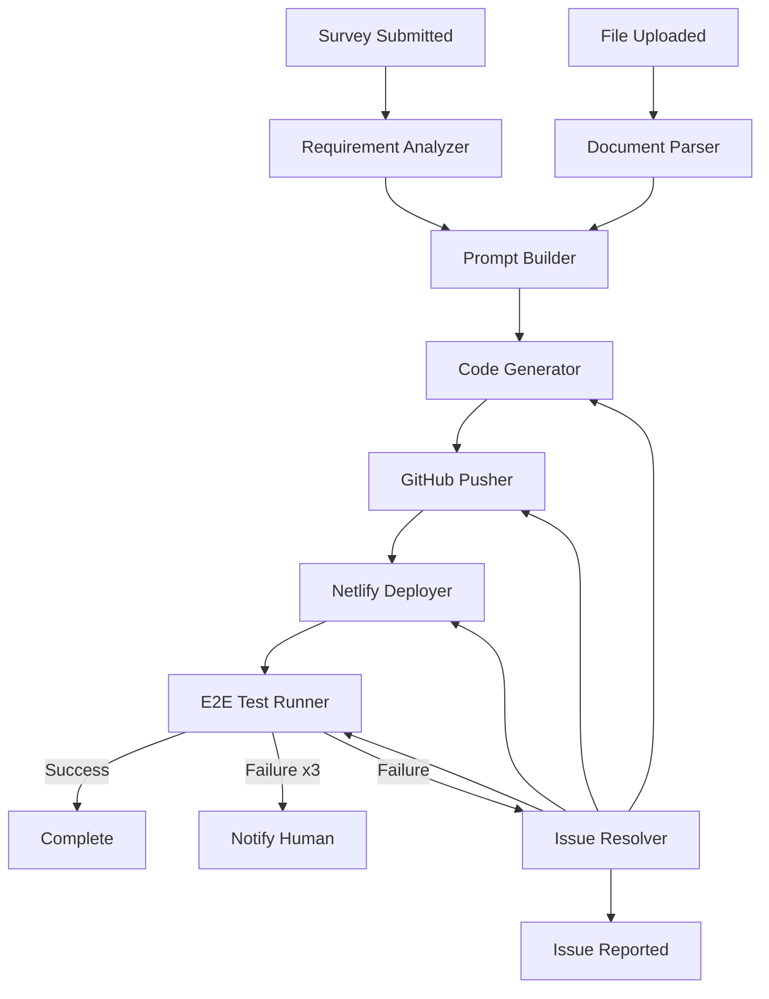

# MAGIC WAND - Product Requirements Document

**버전:** 1.0
**작성일:** 2025-01-15
**작성자:** Claude Sonnet
**상태:** 초안

---

## 1. 제품 개요

### 1.1 제품명
**MAGIC WAND** - 프리랜서 웹 개발자를 위한 MVP 자동 생성 플랫폼

### 1.2 제품 목표
프리랜서 웹 개발자가 고객의 요청사항을 입력하면, AI Agent 시스템이 자동으로 MVP(Minimum Viable Product)를 구축하고 Netlify에 배포까지 완료하는 자동화 시스템을 구축한다.

### 1.3 핵심 가치 제안
> "마법 지팡이를 휘두르듯, 당신의 아이디어를 작동하는 웹 서비스로"

---

## 2. AI Agent 시스템 아키텍처

### 2.1 Agent 개요

MAGIC WAND는 **다중 AI Agent 시스템**으로 구동되며, 각 Agent는 특정 책임을 가지고 순차적으로 또는 병렬적으로 실행된다.

### 2.2 Agent 정의 표준

모든 Agent는 다음 속성을 가진다:

| 속성 | 타입 | 설명 |
|------|------|------|
| `agent_id` | String | 고유 식별자 (예: `requirement-analyzer`) |
| `name` | String | Agent 이름 |
| `role` | String | Agent의 역할 설명 |
| `trigger` | String/Condition | 실행 조건 |
| `completion_mode` | Enum | `auto_close` 또는 `requires_review` |
| `input_schema` | Object | 입력 데이터 구조 |
| `output_schema` | Object | 출력 데이터 구조 |
| `max_retries` | Integer | 최대 재시도 횟수 |
| `timeout` | Integer | 타임아웃 (초) |
| `dependencies` | Array[String] | 선행 Agent ID 목록 |
| `context_sharing` | Object | 다른 Agent와 공유할 컨텍스트 |

### 2.3 Agent 워크플로우 정의

```
┌─────────────────────────────────────────────────────────────┐
│                    MAGIC WAND Workflow                      │
└─────────────────────────────────────────────────────────────┘
                            │
        ┌───────────────────┴───────────────────┐
        │                                       │
   [Trigger]                                [Trigger]
   설문 제출 완료                           파일 업로드
        │                                       │
        ▼                                       ▼
┌───────────────┐                   ┌───────────────┐
│ Agent 1       │                   │ Agent 2       │
│ Requirement   │                   │ Document      │
│ Analyzer      │                   │ Parser        │
└───────────────┘                   └───────────────┘
        │                                       │
        │ auto_close                            │ auto_close
        │                                       │
        └───────────────┬───────────────────────┘
                        ▼
                 ┌───────────────┐
                 │ Agent 3       │
                 │ Prompt        │
                 │ Builder       │
                 └───────────────┘
                        │
                        │ auto_close
                        ▼
                 ┌───────────────┐
                 │ Agent 4       │
                 │ Code          │
                 │ Generator     │
                 └───────────────┘
                        │
                        │ requires_review
                        │ (첫 번째 생성만)
                        ▼
                 ┌───────────────┐
                 │ Agent 5       │
                 │ GitHub        │
                 │ Pusher        │
                 └───────────────┘
                        │
                        │ auto_close
                        ▼
                 ┌───────────────┐
                 │ Agent 6       │
                 │ Netlify       │
                 │ Deployer      │
                 └───────────────┘
                        │
                        │ auto_close
                        ▼
                 ┌───────────────┐
                 │ Agent 7       │
                 │ E2E Test      │
                 │ Runner        │
                 └───────────────┘
                        │
                        │ requires_review
                        │ (3회 실패 시)
                        ▼
                 ┌───────────────┐
                 │ Agent 8       │
                 │ Issue         │
                 │ Resolver      │
                 └───────────────┘
                        │
                        │ auto_close
                        ▼
                 [Complete]
```

### 2.4 Agent 상세 명세

#### Agent 1: Requirement Analyzer

```yaml
agent_id: "requirement-analyzer"
name: "요구사항 분석기"
role: "설문 응답을 분석하여 구조화된 요구사항을 생성"

trigger:
  type: "event"
  event: "survey.submitted"

completion_mode: "auto_close"
max_retries: 3
timeout: 300  # 5분

dependencies: []
context_sharing:
  shares_to: ["prompt-builder", "code-generator"]
  data: ["structured_requirements", "complexity_score"]

input_schema:
  survey_answers:
    type: "object"
    description: "설문조사 응답 전체"
  wizard_level:
    type: "enum"
    values: ["APPRENTICE", "SKILLED", "ARCHMAGE"]
  uploaded_files:
    type: "array"
    items:
      s3_key: "string"
      description: "string"

output_schema:
  structured_requirements:
    type: "object"
    properties:
      project_overview: "object"
      design_spec: "object"
      functional_requirements: "array"
      technical_requirements: "object"
  complexity_score:
    type: "integer"
    range: [1, 100]
  estimated_time:
    type: "object"
    properties:
      minutes: "integer"
      muggle_equivalent: "string"

execution_logic: |
  1. 설문 응답 파싱 및 유효성 검증
  2. 마법사 레벨에 따른 분석 깊이 결정
     - APPRENTICE: 템플릿 기반 분석
     - SKILLED: 50% 커스터마이징 분석
     - ARCHMAGE: 완전 커스텀 분석
  3. 복잡도 점수 산출 (1~100)
  4. 예상 시간 계산 (Claude 추론)
  5. 머글 기준 맨먼스 환산

failure_handling:
  on_error: "retry_with_fallback_template"
  max_retries_exceeded: "use_template_based_requirements"
```

---

#### Agent 2: Document Parser

```yaml
agent_id: "document-parser"
name: "문서 파서"
role: "업로드된 파일을 업스테이지 API로 파싱하여 구조화된 데이터 추출"

trigger:
  type: "event"
  event: "file.uploaded"
  parallel: true  # 파일별로 병렬 실행

completion_mode: "auto_close"
max_retries: 3
timeout: 600  # 10분 (파일 크기에 따라 다름)

dependencies: []
context_sharing:
  shares_to: ["prompt-builder", "code-generator"]
  data: ["parsed_documents", "extracted_insights"]

input_schema:
  file_metadata:
    s3_key: "string"
    file_name: "string"
    file_type: "string"
    file_size: "integer"
    user_description: "string"  # 사용자가 입력한 설명

output_schema:
  parsed_document:
    type: "object"
    properties:
      file_id: "string"
      raw_text: "string"  # OCR 결과
      layout_info: "object"  # 레이아웃 분석
      tables: "array"  # 추출된 표
      images: "array"  # 이미지 메타데이터
      confidence: "float"
  extracted_insights:
    type: "object"
    properties:
      document_type: "enum"  # ["design-reference", "spec-document", "wireframe", "other"]
      key_requirements: "array"
      visual_style: "object"  # 색상, 폰트 등
      suggested_features: "array"

execution_logic: |
  1. S3에서 파일 다운로드
  2. 파일 타입 감지
     - 이미지: OCR + 레이아웃 분석
     - PDF: 도큐멘트 파싱
     - 기타: 기본 처리
  3. 업스테이지 API 호출
     - OCR: 텍스트 추출
     - Layout Analysis: 구조 파악
     - Table Extraction: 표 데이터 추출
  4. Claude로 문서 유형 추론
  5. 사용자 설명과 결합하여 인사이트 추출

external_apis:
  - name: "Upstage Document AI"
    endpoint: "https://api.upstage.ai/v1/document-ai/parse"
    auth_method: "Bearer Token"
    timeout: 300

failure_handling:
  on_error: "mark_as_failed_and_continue"
  user_notification: "파일 파싱 실패: {file_name}. 기본 텍스트만 사용합니다."
```

---

#### Agent 3: Prompt Builder

```yaml
agent_id: "prompt-builder"
name: "프롬프트 빌더"
role: "요구사항과 파싱된 문서를 Claude Code 프롬프트로 변환"

trigger:
  type: "dependency_satisfied"
  dependencies: ["requirement-analyzer", "document-parser"]

completion_mode: "auto_close"
max_retries: 2
timeout: 180  # 3분

dependencies:
  - "requirement-analyzer"
  - "document-parser"

context_sharing:
  shares_to: ["code-generator"]
  data: ["claude_code_prompt", "generation_plan"]

input_schema:
  structured_requirements: "object"
  parsed_documents: "array"
  complexity_score: "integer"
  wizard_level: "enum"

output_schema:
  claude_code_prompt:
    type: "string"
    description: "Claude Code CLI에 전달할 전체 프롬프트"
  generation_plan:
    type: "object"
    properties:
      phases: "array"
      estimated_steps: "integer"
      risk_factors: "array"
  attachments:
    type: "array"
    description: "파일 참조 URL 목록"
    items:
      type: "string"
      url: "string"
      description: "string"

execution_logic: |
  1. 요구사항 분석 결과 수집
  2. 문서 파싱 결과 통합
  3. 마법사 레벨에 따른 프롬프트 전략 결정
     - APPRENTICE: 템플릿 + 기본 지침
     - SKILLED: 커스터마이징 지침 추가
     - ARCHMAGE: 완전 자유형 프롬프트
  4. Claude Code 프롬프트 구성
     - 프로젝트 개요
     - 기술 스택 제약 (Next.js + shadcn + Prisma + Postgres)
     - 디자인 가이드
     - 레퍼런스 파일 인사이트
     - 기능 요구사항
     - 배포 정보
  5. 첨부파일 URL 정리

prompt_template: |
  You are an expert full-stack developer specializing in Next.js and modern web development.

  # Project Overview
  {project_overview}

  # Tech Stack (Fixed)
  - Next.js 14+ (App Router)
  - shadcn/ui
  - Prisma ORM
  - Postgres (Netlify DB)
  - Netlify deployment

  # Design Guidelines
  {design_spec}

  # Reference Materials
  {reference_materials}

  # Functional Requirements
  {functional_requirements}

  # Deployment Target
  - GitHub: {github_repo_url}
  - Netlify subdomain: {subdomain}

  # Instructions
  1. Create a complete Next.js project
  2. Install and configure shadcn/ui
  3. Set up Prisma with the required schema
  4. Build all pages and components
  5. Ensure responsive design (mobile-first)
  6. Prepare for Netlify deployment

  Please proceed step by step and explain your progress.
```

---

#### Agent 4: Code Generator

```yaml
agent_id: "code-generator"
name: "코드 생성기"
role: "Claude Code CLI를 실행하여 MVP 코드 생성"

trigger:
  type: "dependency_satisfied"
  dependencies: ["prompt-builder"]

completion_mode: "requires_review"
max_retries: 5  # 코드 생성은 여러 번 재시도
timeout: 7200  # 2시간 (최대)

dependencies:
  - "prompt-builder"

context_sharing:
  shares_to: ["github-pusher", "e2e-test-runner", "issue-resolver"]
  data: ["generated_code_structure", "generation_logs", "code_quality_metrics"]

input_schema:
  claude_code_prompt: "string"
  generation_plan: "object"
  attachments: "array"
  github_repo_url: "string"

output_schema:
  generation_result:
    type: "object"
    properties:
      status: "enum"  # ["success", "partial", "failed"]
      files_created: "array"
      code_structure: "object"
      generation_logs: "array"
      warnings: "array"
  code_quality_metrics:
    type: "object"
    properties:
      total_lines: "integer"
      test_coverage: "float"
      eslint_errors: "integer"
      type_errors: "integer"

execution_logic: |
  1. 작업 디렉토리 생성
  2. Claude Code CLI 실행
     - 명령어: npx claude-code --dangerously-skip-permissions
     - 입력: 프롬프트 + 첨부파일
  3. 실시간 로그 스트리밍
  4. 생성된 파일 검증
  5. 코드 품질 메트릭 수집

review_criteria:
  - checks: [
      "typescript_compile_success",
      "eslint_no_errors",
      "all_dependencies_installed",
      "nextjs_config_valid"
    ]
  - on_review_fail: "retry_with_feedback"
  - max_review_failures: 3

activity_log:
  enabled: true
  format: "markdown"
  includes:
    - "step_by_step_progress"
    - "files_created_with_purpose"
    - "decisions_made"
    - "errors_encountered"

comments:
  allow_interactive: false  # 비대화형 모드
  capture_all: true

failure_handling:
  on_partial_generation: "save_progress_and_retry"
  on_complete_failure: "notify_user_and_request_intervention"
```

---

#### Agent 5: GitHub Pusher

```yaml
agent_id: "github-pusher"
name: "GitHub 푸셔"
role: "생성된 코드를 GitHub 레포지토리에 푸시"

trigger:
  type: "dependency_satisfied"
  dependencies: ["code-generator"]
  condition: "code_generator.status == 'success' OR code_generator.status == 'partial'"

completion_mode: "auto_close"
max_retries: 3
timeout: 300  # 5분

dependencies:
  - "code-generator"

context_sharing:
  shares_to: ["netlify-deployer", "issue-resolver"]
  data: ["github_commit_sha", "github_branch"]

input_schema:
  code_directory: "string"
  github_repo_url: "string"
  github_pat: "string"
  commit_message:
    type: "string"
    default: "feat: initial MVP generated by MAGIC WAND 🪄"

output_schema:
  push_result:
    type: "object"
    properties:
      commit_sha: "string"
      branch: "string"
      repository_url: "string"
      files_pushed: "integer"

execution_logic: |
  1. GitHub PAT로 레포지토리 인증
  2. 브랜치 생성 (기본: main)
  3. 파일 초기화 및 커밋
  4. 원격 레포지토리에 푸시
  5. 결과 검증

git_config:
  user_name: "MAGIC WAND"
  user_email: "magic-wand@automation.local"

failure_handling:
  on_auth_error: "notify_invalid_pat"
  on_push_conflict: "create_new_branch"
  on_network_error: "retry_with_backoff"
```

---

#### Agent 6: Netlify Deployer

```yaml
agent_id: "netlify-deployer"
name: "Netlify 배포자"
role: "GitHub 레포지토리를 Netlify에 연동하고 배포"

trigger:
  type: "dependency_satisfied"
  dependencies: ["github-pusher"]

completion_mode: "auto_close"
max_retries: 3
timeout: 600  # 10분 (빌드 시간 고려)

dependencies:
  - "github-pusher"

context_sharing:
  shares_to: ["e2e-test-runner", "issue-resolver"]
  data: ["netlify_site_url", "netlify_site_id", "deployment_logs"]

input_schema:
  github_repo_url: "string"
  github_branch: "string"
  subdomain: "string"  # {project}-{random5}
  netlify_auth_token: "string"

output_schema:
  deployment_result:
    type: "object"
    properties:
      site_id: "string"
      site_url: "string"
      deploy_url: "string"
      deploy_id: "string"
      ssl_url: "string"
      build_status: "enum"

execution_logic: |
  1. Netlify API로 사이트 생성
     - 이름: {project_name}-{random5}
     - 빌드 설정: Next.js 기본값
  2. GitHub 레포지토리 연동
     - 웹훅 자동 설정
  3. 첫 배포 트리거
  4. 배포 상태 모니터링
  5. 배포 완료 시 URL 반환

netlify_config:
  build_command: "npm run build"
  publish_directory: ".next"
  node_version: "20"
  environment_variables:
    - key: "NETLIFY"
      value: "true"

monitoring:
  poll_interval: 30  # 30초마다 배포 상태 확인
  max_wait_time: 600  # 최대 10분 대기

failure_handling:
  on_build_failure: "capture_build_logs_and_notify"
  on_deploy_timeout: "mark_as_failed_and_manual_intervention"
```

---

#### Agent 7: E2E Test Runner

```yaml
agent_id: "e2e-test-runner"
name: "E2E 테스트 실행기"
role: "생성된 MVP에 대해 E2E 테스트 자동 생성 및 실행"

trigger:
  type: "dependency_satisfied"
  dependencies: ["netlify-deployer"]
  condition: "netlify_deployer.build_status == 'ready'"

completion_mode: "requires_review"
max_retries: 3
timeout: 900  # 15분

dependencies:
  - "netlify-deployer"

context_sharing:
  shares_to: ["issue-resolver"]
  data: ["test_results", "failed_tests", "coverage_report"]

input_schema:
  deployed_url: "string"
  test_requirements: "object"
  complexity_score: "integer"

output_schema:
  test_results:
    type: "object"
    properties:
      total_tests: "integer"
      passed: "integer"
      failed: "integer"
      skipped: "integer"
      duration: "integer"
  failed_tests:
    type: "array"
    items:
      test_name: "string"
      error_message: "string"
      stack_trace: "string"
      screenshot_url: "string"
  coverage_report:
    type: "object"
    properties:
      lines: "float"
      functions: "float"
      branches: "float"
      statements: "float"

execution_logic: |
  1. 배포된 사이트 분석
  2. 테스트 시나리오 자동 생성 (Playwright)
     - 기본 테스트: 홈 페이지 로드
     - 네비게이션 테스트
     - 반응형 테스트
     - 기능별 테스트 (요구사항 기반)
  3. 테스트 실행
  4. 실패 시 스크린샷 캡처
  5. 결과 보고서 생성

test_framework:
  e2e: "Playwright"
  unit: "Vitest"
  component: "@testing-library/react"

test_generation_strategy:
  complexity_based:
    low:
      - smoke_tests
      - navigation_tests
    medium:
      - all_low_tests
      - form_validation_tests
      - api_integration_tests
    high:
      - all_medium_tests
      - edge_case_tests
      - performance_tests

review_criteria:
  - checks: [
      "all_critical_tests_pass",
      "test_coverage >= 60",
      "no_critical_bugs"
    ]
  - on_review_fail: "trigger_issue_resolver"
  - max_iterations: 3

failure_handling:
  on_test_failure:
    action: "capture_evidence_and_retry"
    evidence_to_capture:
      - "screenshots"
      - "network_logs"
      - "console_errors"
      - "page_source"
  on_max_retries_exceeded:
    action: "escalate_to_human"
    notification: "3회 시도 후에도 테스트 실패. 개입 필요."

attachments:
  screenshots:
    enabled: true
    storage: "s3"
    format: "png"
  videos:
    enabled: true
    on_failure_only: true
  logs:
    enabled: true
    format: "json"
```

---

#### Agent 8: Issue Resolver

```yaml
agent_id: "issue-resolver"
name: "이슈 해결사"
role: "사용자가 리포트한 이슈를 자동으로 분석하고 수정"

trigger:
  type: "event"
  event: "issue.reported"
  source: "slack"

completion_mode: "auto_close"
max_retries: 5
timeout: 1800  # 30분

dependencies:
  optional: ["e2e-test-runner"]  # 테스트 결과가 있으면 참조

context_sharing:
  shares_to: ["github-pusher", "netlify-deployer", "e2e-test-runner"]
  data: ["issue_analysis", "fix_commits", "resolution_logs"]

input_schema:
  issue_report:
    type: "object"
    properties:
      slack_channel: "string"
      slack_ts: "string"
      user_message: "string"
      reported_at: "datetime"
  context:
    type: "object"
    properties:
      project_id: "string"
      deployment_url: "string"
      github_branch: "string"
      previous_test_results: "object"

output_schema:
  resolution_result:
    type: "object"
    properties:
      issue_type: "enum"  # ["bug", "feature", "improvement", "cannot_fix"]
      root_cause: "string"
      fix_applied: "boolean"
      fix_description: "string"
      new_commit_sha: "string"
      redeployed: "boolean"
      test_results: "object"

execution_logic: |
  1. Slack 메시지 파싱
  2. 이슈 분류 (Claude 추론)
     - 버그
     - 기능 요청
     - 개선사항
     - 해결 불가 (사람 개입 필요)
  3. 이슈 재현 시도
     - E2E 테스트로 재현
     - 스크린샷/로그 캡처
  4. 근본 원인 분석
  5. 수정 코드 생성
  6. 수정 사항 적용
  7. 재배포
  8. 재테스트
  9. Slack으로 결과 알림

issue_classification:
  auto_fixable:
    - "css_styling_issues"
    - "navigation_bugs"
    - "form_validation_errors"
    - "api_integration_bugs"
    - "responsive_design_issues"
  requires_human:
    - "ambiguous_requirements"
    - "complex_business_logic"
    - "security_concerns"
    - "performance_optimization"

retry_strategy:
  max_attempts: 5
  backoff: "exponential"
  on_each_retry:
    - "analyze_why_fix_failed"
    - "adjust_fix_strategy"
    - "apply_new_fix"

activity_log:
  enabled: true
  includes:
    - "issue_analysis"
    - "fix_attempts"
    - "code_changes"
    - "test_results"

slack_notifications:
  on_issue_received: "🔍 이슈를 분석 중입니다..."
  on_fix_applied: "✅ 수정 완료! 재배포 중..."
  on_fix_failed: "❌ 수정 실패. 개입이 필요합니다."
  on_redeploy_complete: "🚀 재배포 완료! 확인해주세요: {url}"

comments:
  type: "thread"
  destination: "slack"
  format: "markdown"
  includes:
    - "fix_summary"
    - "code_diff"
    - "test_results"

failure_handling:
  on_ambiguous_issue:
    action: "ask_clarifying_questions"
    questions: [
      "어떤 페이지에서 문제가 발생했나요?",
      "어떤 동작을 기대하셨나요?",
      "스크린샷을 첨부해주실 수 있나요?"
    ]
  on_max_retries_exceeded:
    action: "escalate_to_human"
    notification: "자동 수정이 어렵습니다. 개발자의 도움이 필요합니다."
```

---

### 2.5 Agent 간 커뮤니케이션

#### Context Sharing Protocol

```typescript
interface AgentContext {
  agent_id: string;
  timestamp: ISO8601;
  data: Record<string, any>;
  metadata: {
    version: string;
    ttl?: number;  // Time to live in seconds
  };
}

interface ContextShareRequest {
  from_agent: string;
  to_agents: string[];
  context_key: string;
  data: any;
  strategy: "broadcast" | "direct" | "publish_subscribe";
}
```

#### Event Bus

```yaml
event_bus:
  type: "redis_pub_sub"
  events:
    - name: "survey.submitted"
      publisher: "frontend"
      subscribers: ["requirement-analyzer"]

    - name: "file.uploaded"
      publisher: "frontend"
      subscribers: ["document-parser"]

    - name: "requirement.analyzed"
      publisher: "requirement-analyzer"
      subscribers: ["prompt-builder"]

    - name: "document.parsed"
      publisher: "document-parser"
      subscribers: ["prompt-builder"]

    - name: "prompt.built"
      publisher: "prompt-builder"
      subscribers: ["code-generator"]

    - name: "code.generated"
      publisher: "code-generator"
      subscribers: ["github-pusher", "activity_logger"]

    - name: "github.pushed"
      publisher: "github-pusher"
      subscribers: ["netlify-deployer", "activity_logger"]

    - name: "deployment.ready"
      publisher: "netlify-deployer"
      subscribers: ["e2e-test-runner", "slack-notifier"]

    - name: "test.failed"
      publisher: "e2e-test-runner"
      subscribers: ["issue-resolver", "slack-notifier"]

    - name: "issue.reported"
      publisher: "slack-bot"
      subscribers: ["issue-resolver"]

    - name: "issue.resolved"
      publisher: "issue-resolver"
      subscribers: ["github-pusher", "netlify-deployer", "slack-notifier"]
```

---

### 2.6 Agent 실행 순서 (DAG)



---

### 2.7 Agent 상태 관리

```typescript
enum AgentStatus {
  IDLE = "idle",
  RUNNING = "running",
  WAITING = "waiting",  // 의존성 대기 중
  COMPLETED = "completed",
  FAILED = "failed",
  RETRYING = "retrying",
  CANCELLED = "cancelled"
}

interface AgentState {
  agent_id: string;
  status: AgentStatus;
  started_at?: ISO8601;
  completed_at?: ISO8601;
  retry_count: number;
  error?: {
    message: string;
    stack_trace?: string;
    retryable: boolean;
  };
  output?: any;
  attachments?: Attachment[];
  comments?: Comment[];
}
```

---

### 2.8 Agent Activity Log 형식

```yaml
activity_log:
  format: "markdown"
  structure: |
    # Agent Activity Log: {agent_name}

    **Execution ID:** {execution_id}
    **Started At:** {timestamp}
    **Triggered By:** {trigger_event}

    ## Execution Summary
    - **Status:** {status}
    - **Duration:** {duration}
    - **Retries:** {retry_count}

    ## Steps Performed
    {steps}

    ## Files Created/Modified
    {file_changes}

    ## Decisions Made
    {decisions}

    ## Errors Encountered
    {errors}

    ## Attachments
    {attachments}

    ## Comments
    {comments}

    ## Output
    ```json
    {output}
    ```

storage:
  type: "s3"
  bucket: "magic-wand-activity-logs"
  retention_days: 90
```

---

### 2.9 Agent 실패 처리 및 롤백

```yaml
failure_handling:
  strategy: "checkpoint_and_rollback"

  checkpoints:
    - name: "requirements_analyzed"
      agent: "requirement-analyzer"
      rollback_action: "use_fallback_template"

    - name: "documents_parsed"
      agent: "document-parser"
      rollback_action: "continue_without_parsed_docs"

    - name: "prompt_built"
      agent: "prompt-builder"
      rollback_action: "use_cached_prompt"

    - name: "code_generated"
      agent: "code-generator"
      rollback_action: "restore_from_git_history"

    - name: "github_pushed"
      agent: "github-pusher"
      rollback_action: "force_push_previous_commit"

    - name: "netlify_deployed"
      agent: "netlify-deployer"
      rollback_action: "rollback_deployment"

    - name: "tests_passed"
      agent: "e2e-test-runner"
      rollback_action: "keep_previous_deployment"

  rollback_triggers:
    - "agent.max_retries_exceeded"
    - "user.cancel_requested"
    - "critical.error"
    - "timeout.exceeded"

  recovery_options:
    - label: "Resume from checkpoint"
      action: "resume_from_last_checkpoint"
      available: true

    - label: "Retry failed agent"
      action: "retry_agent"
      available: "retry_count < 3"

    - label: "Skip and continue"
      action: "skip_agent"
      available: "agent.is_skippable"

    - label: "Start over"
      action: "start_fresh"
      available: true
```

---

## 3. 사용자 페르소나

(이전 내용과 동일)

---

## 4. 사용자 시나리오

(이전 내용과 동일)

---

## 5. 기능 요구사항

(이전 내용과 동일, Agent 관련 부분 추가)

---

## 6. 기술 스택

### 6.1 MAGIC WAND 서비스

#### Frontend (모바일 웹)
- **Framework:** Next.js 14+ (App Router)
- **UI Library:** shadcn/ui
- **Styling:** Tailwind CSS
- **Forms:** React Hook Form + Zod
- **State Management:** Zustand

#### Backend (Express 서버)
- **Runtime:** Node.js 20+
- **Framework:** Express
- **API:** RESTful API
- **Job Queue:** Bull (Redis)
- **ORM:** Prisma
- **Database:** Postgres (Netlify DB)
- **File Storage:** AWS S3

#### Agent Orchestration
- **Claude Code CLI:** 핵심 코드 생성
- **Event Bus:** Redis Pub/Sub
- **State Management:** Redis
- **Activity Logging:** S3 + Markdown

#### External APIs
- **업스테이지:** OCR/문서 파싱
- **GitHub API:** 레포지토리 관리
- **Netlify API:** 배포 자동화
- **Slack API:** 이슈 리포트

---

## 7. 데이터 모델

(이전 내용에 Agent 상태 관련 테이블 추가)

```prisma
model AgentExecution {
  id              String   @id @default(cuid())
  projectId       String

  agentId         String
  agentName       String
  status          AgentStatus @default(RUNNING)

  startedAt       DateTime @default(now())
  completedAt     DateTime?
  retryCount      Int      @default(0)

  input           Json
  output          Json?
  error           Json?

  attachments     Json?    // Attachment[]
  comments        Json?    // Comment[]
  activityLogUrl  String?  // S3 URL

  project         Project  @relation(fields: [projectId], references: [id])
}

enum AgentStatus {
  IDLE
  RUNNING
  WAITING
  COMPLETED
  FAILED
  RETRYING
  CANCELLED
}
```

---

## 8. API 설계

(이전 내용에 Agent 상태 조회 API 추가)

#### GET /api/agents/executions/:projectId
Agent 실행 상태 조회

#### GET /api/agents/activity-log/:executionId
Activity Log 조회 (Markdown)

---

## 9. UI/UX 가이드

(이전 내용과 동일)

---

## 10. 개발 단계 (Phases)

### Phase 1: Agent 시스템 기반 (Week 1-2)
- [ ] Agent 실행 프레임워크 구축
- [ ] Event Bus 구현 (Redis Pub/Sub)
- [ ] Context Sharing 시스템
- [ ] Activity Log 기능
- [ ] Agent 상태 관리

### Phase 2: 핵심 Agent 개발 (Week 3-6)
- [ ] Requirement Analyzer Agent
- [ ] Document Parser Agent
- [ ] Prompt Builder Agent
- [ ] Code Generator Agent
- [ ] GitHub Pusher Agent
- [ ] Netlify Deployer Agent
- [ ] E2E Test Runner Agent

### Phase 3: 이슈 해결 Agent (Week 7-8)
- [ ] Issue Resolver Agent
- [ ] Slack Bot 연동
- [ ] 자동 수정 및 재배파 파이프라인

### Phase 4: 프론트엔드 (Week 3-10, 병행)
- [ ] 모바일 웹 개발
- [ ] 실시간 상태 표시
- [ ] 파일 업로드

### Phase 5: 테스트 및 최적화 (Week 11-12)
- [ ] Agent 간 통합 테스트
- [ ] 실패 시나리오 테스트
- [ ] 성능 최적화

---

## 11. 리스크 및 완화 계획

| 리스크 | 영향 | 확률 | 완화 계획 |
|--------|------|------|-----------|
| Agent가 의도한 대로 동작하지 않음 | 높음 | 중 | 체크포인트/롤백 시스템, 사람 개입 지점 |
| Claude Code 생성 품질 낮음 | 높음 | 중 | 템플릿 백업, 재시도 로직 |
| Agent 간 통신 실패 | 중 | 낮 | Event Bus 재시도, 메시지 영구화 |
| 전체 파이프라인 실패 | 높음 | 낮 | 체크포인트별 롤백 |

---

## 12. 성공 지표 (KPIs)

- Agent 성공률: 90% 이상
- 전체 파이프라인 성공률: 85% 이상
- 평균 생성 시간: 3시간 이내
- 자동 이슈 해결률: 70% 이상

---

## 13. 부록

### 13.1 Agent 실행 예시

```yaml
execution_example:
  project_name: "portfolio-abc12"
  wizard_level: "SKILLED"
  uploaded_files: 3

  timeline:
    - timestamp: "2025-01-15T10:00:00Z"
      agent: "document-parser"
      status: "running"
      message: "파일 3개 파싱 시작"

    - timestamp: "2025-01-15T10:05:00Z"
      agent: "document-parser"
      status: "completed"
      message: "파일 파싱 완료 (OCR: 98% 신뢰도)"

    - timestamp: "2025-01-15T10:10:00Z"
      agent: "requirement-analyzer"
      status: "completed"
      message: "요구사항 분석 완료 (복잡도: 65/100)"

    - timestamp: "2025-01-15T10:15:00Z"
      agent: "prompt-builder"
      status: "completed"
      message: "프롬프트 빌드 완료"

    - timestamp: "2025-01-15T10:20:00Z"
      agent: "code-generator"
      status: "running"
      message: "Claude Code로 코드 생성 중..."

    - timestamp: "2025-01-15T12:30:00Z"
      agent: "code-generator"
      status: "completed"
      message: "코드 생성 완료 (파일 47개, 3,421줄)"

    - timestamp: "2025-01-15T12:35:00Z"
      agent: "github-pusher"
      status: "completed"
      message: "GitHub 푸시 완료 (commit: abc123)"

    - timestamp: "2025-01-15T12:40:00Z"
      agent: "netlify-deployer"
      status: "running"
      message: "Netlify 배포 중..."

    - timestamp: "2025-01-15T12:48:00Z"
      agent: "netlify-deployer"
      status: "completed"
      message: "배포 완료 (portfolio-abc12.netlify.app)"

    - timestamp: "2025-01-15T12:50:00Z"
      agent: "e2e-test-runner"
      status: "running"
      message: "E2E 테스트 실행 중..."

    - timestamp: "2025-01-15T13:00:00Z"
      agent: "e2e-test-runner"
      status: "completed"
      message: "테스트 통과 (24/24)"

    - timestamp: "2025-01-15T13:00:00Z"
      status: "complete"
      message: "🎉 MVP 생성 완료!"
```

---

**문서 끝**
