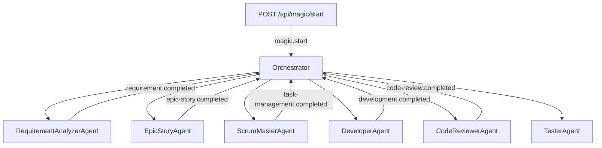
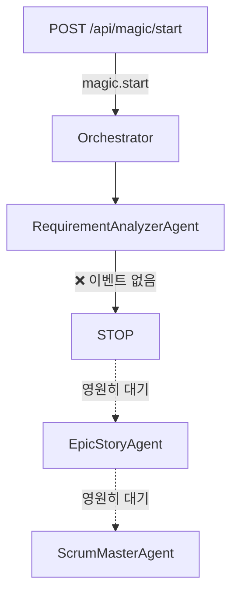

# MAGIC WAND - Agent 디버깅 보고서

**분석일:** 2026-01-18
**분석자:** MAGIC WAND Development Team
**심각도:** 🔴 **CRITICAL** - 시스템이 작동하지 않음

---

## 실행 요약

### 핵심 발견

**Superpowers Workflow Agent들이 작동하지 않는 근본 원인이 발견되었습니다:**

> **Agent 체이닝 메커니즘이 전혀 구현되지 않음**

- ✅ Agent들은 정상적으로 구현됨
- ✅ Event Bus는 정상적으로 작동
- ✅ Orchestrator는 정상적으로 초기화
- ❌ **하지만 Agent 간 연결 고리가 완전히 누락됨**

### 영향

- **RequirementAnalyzerAgent만 실행**되고 모든 후속 Agent들이 실행되지 않음
- 전체 MVP 자동화 워크플로우가 첫 번째 단계에서 멈춤
- 프로젝트 목적인 "AI 기반 MVP 자동화"가 불가능

---

## 문제 상세 분석

### 1. 워크플로우 실행 순서 (PRD 기대)

```
1. RequirementAnalyzerAgent (요구사항 분석)
   ↓ requirement.completed 이벤트 발행 예상

2. EpicStoryAgent (Epic & Story 생성)
   ↓ epic-story.completed 이벤트 발행 예상

3. ScrumMasterAgent (Task 관리)
   ↓ task-management.completed 이벤트 발행 예상

4. DeveloperAgent (코드 개발)
   ↓ development.completed 이벤트 발행 예상

5. CodeReviewerAgent (코드 리뷰)
   ↓ code-review.completed 이벤트 발행 예상

6. TesterAgent (테스트)
   ↓ testing.completed 이벤트 발행 예상

7. PromptBuilderAgent (프롬프트 빌딩)
   ↓ prompt-built 이벤트 발행 예상

8. CodeGeneratorAgent (코드 생성)
   ↓ code.generated 이벤트 발행 예상

9. GitHubPusherAgent (GitHub 푸시)
   ↓ github.pushed 이벤트 발행 예상

10. NetlifyDeployerAgent (Netlify 배포)
    ↓ deployment.completed 이벤트 발행 예상

11. E2ETestRunnerAgent (E2E 테스트)
    ↓ e2e-test.completed 이벤트 발행 예상

12. IssueResolverAgent (이슈 해결 - 필요시)
```

### 2. 실제 실행 현황

```
1. RequirementAnalyzerAgent (요구사항 분석) ✅ 실행됨
   ↓

   [STOP] ❌ 어떤 이벤트도 발행되지 않음
   ↓

   [모든 후속 Agent들이 영원히 대기] ❌
```

### 3. 근본 원인 3가지

#### 문제 1: Orchestrator가 첫 번째 Agent만 실행

**파일:** `apps/api/src/orchestrator.ts:68-95`

```typescript
public async runMagic(data: MagicStartEvent) {
  // ... 초기화 코드 ...

  // 2. 첫 번째 Agent 실행 (RequirementAnalyzer)
  const agentResult = await this.runAgent('requirement-analyzer', projectId, {
    projectId,
    project,
    files,
    survey,
  });

  // ⚠️ 여기서 끝! 다음 Agent를 실행하는 코드가 없음!
  console.log(`✅ Magic orchestration started for project: ${projectId}`);
}
```

**문제:**
- Orchestrator가 RequirementAnalyzerAgent를 실행한 후 함수가 종료됨
- EpicStoryAgent, ScrumMasterAgent 등 후속 Agent들을 실행하는 코드가 전혀 없음
- 체이닝 로직이 구현되지 않음

#### 문제 2: Agent가 완료 이벤트를 발행하지 않음

**파일:** `packages/agents/src/agents/RequirementAnalyzerAgent.ts`

```typescript
async execute(input: RequirementAnalyzerInput): Promise<AgentExecutionResult> {
  // ... PRD 생성 로직 ...

  // PRD 옵션 생성 완료
  const prdOptions = await this.generateMultiplePRDs(input, context);

  // ⚠️ 이벤트 발행 코드가 없음!
  // eventBus.publish('requirement.completed', {...});  // 이 코드가 없음!

  return {
    status: AgentStatus.COMPLETED,
    output: {
      prdOptions,
      summary,
    },
  };
}
```

**검증:** `packages/agents/` 폴더 전체 Grep 결과

```bash
$ grep -r "eventBus.publish" packages/agents/
# 결과: 일치하는 항목 없음
```

**문제:**
- 모든 Agent가 `execute()` 메서드에서 결과를 반환하지만
- 완료 이벤트를 발행하는 코드가 **단 하나도 없음**
- 다음 Agent들이 기다리는 이벤트가 절대 도착하지 않음

#### 문제 3: Orchestrator가 Agent 완료 이벤트를 수신하지 않음

**파일:** `apps/api/src/orchestrator.ts:47-66`

```typescript
async start() {
  const eventBus = getEventBus();

  // magic.start 이벤트만 수신
  await eventBus.subscribe('magic.start', async (data: MagicStartEvent) => {
    await this.runMagic(data);
  });

  // ⚠️ 다른 이벤트 리스너가 없음!
  // eventBus.subscribe('requirement.completed', ...)  // 없음!
  // eventBus.subscribe('epic-story.completed', ...)    // 없음!
  // eventBus.subscribe('task.assigned', ...)           // 없음!
}
```

**검증:** `apps/api/src/` 폴더 Grep 결과

```bash
$ grep -r "subscribe(" apps/api/src/
# 결과: 오직 'magic.start' 이벤트만 구독
```

**문제:**
- Orchestrator가 오직 'magic.start' 이벤트만 수신
- Agent 완료 이벤트('requirement.completed', 'epic-story.completed' 등)를 수신하는 핸들러가 없음
- 이벤트가 발행된다 해도 처리할 코드가 없음

---

## Event Flow 분석

### 기대되는 Event Flow



### 실제 Event Flow



---

## Agent 설정 검증

### Agent Trigger 설정 (올바름)

**EpicStoryAgent 설정:**
```typescript
{
  agentId: 'epic-story',
  name: 'Epic & Story 생성',
  trigger: {
    type: 'event',
    event: 'requirement.completed',  // ✅ 올바른 이벤트 명
  },
}
```

**ScrumMasterAgent 설정:**
```typescript
{
  agentId: 'scrum-master',
  name: 'Task 관리',
  trigger: {
    type: 'event',
    event: 'epic-story.completed',  // ✅ 올바른 이벤트 명
  },
}
```

**문제:**
- Agent들이 기다리는 이벤트 이름은 올바름
- 하지만 그 이벤트를 발행하는 코드가 없음

---

## Redis Event Bus 상태

### Event Bus 구현 (정상)

**파일:** `packages/agent-framework/src/event-bus.ts`

```typescript
export class EventBus {
  async publish(eventName: string, data: any): Promise<void> {
    if (!this.isConnected) {
      logger.warn({ eventName }, 'Event Bus not connected, message not published');
      return;
    }

    const event: EventBusEvent = {
      name: eventName,
      data,
      timestamp: new Date().toISOString(),
    };

    await this.publisher.publish(eventName, JSON.stringify(event));
  }

  async subscribe(eventName: string, handler: EventHandler): Promise<void> {
    if (!this.handlers.has(eventName)) {
      await this.subscriber.subscribe(eventName);
      // ...
    }
    this.handlers.get(eventName)!.push(handler);
  }
}
```

**상태:**
- ✅ Event Bus는 정상적으로 구현됨
- ✅ Redis Pub/Sub 메커니즘 사용
- ✅ `publish()`와 `subscribe()` 메서드가 작동

**하지만:**
- ❌ Agent들이 `publish()`를 호출하지 않음
- ❌ Orchestrator가 agent 완료 이벤트를 `subscribe()`하지 않음

---

## 영향 분석

### 영향받는 기능

1. **Epic & Story 생성** ❌
   - EpicStoryAgent가 실행되지 않음
   - PRD를 기반으로 한 Epic/Story 분해가 불가능

2. **Task 관리** ❌
   - ScrumMasterAgent가 실행되지 않음
   - 개발 계획 수립이 불가능

3. **코드 개발** ❌
   - DeveloperAgent가 실행되지 않음
   - 실제 코드 생성이 불가능

4. **코드 리뷰** ❌
   - CodeReviewerAgent가 실행되지 않음

5. **테스트** ❌
   - TesterAgent가 실행되지 않음

6. **빌드 및 배포** ❌
   - PromptBuilderAgent, CodeGeneratorAgent가 실행되지 않음
   - GitHubPusherAgent, NetlifyDeployerAgent가 실행되지 않음

### 비즈니스 영향

- **MAGIC WAND 플랫폼의 핵심 가치인 "MVP 자동화"가 불가능**
- 사용자는 PRD 생성까지만 가능하고, 실제 개발은 수동으로 진행해야 함
- Superpowers Workflow의 장점을 전혀 활용할 수 없음

---

## 해결 방안

### 해결 방법 1: Orchestrator에서 Agent 체이닝 구현 (추천)

**장점:**
- 중앙집중식 제어로 디버깅 용이
- Agent 간 의존성을 명확히 관리
- 에러 핸들링과 재시도 로직을 일관되게 구현 가능

**구현 방법:**

```typescript
// apps/api/src/orchestrator.ts

public async runMagic(data: MagicStartEvent) {
  const { projectId, project, files, survey } = data;

  try {
    // Phase 1: 분석 및 설계
    const requirementResult = await this.runAgent('requirement-analyzer', projectId, {...});
    if (requirementResult.status !== AgentStatus.COMPLETED) throw new Error('Requirement analysis failed');

    const epicStoryResult = await this.runAgent('epic-story', projectId, {
      ...requirementResult.output,
      selectedPRD: requirementResult.output.prdOptions[1], // 표준형 선택
    });
    if (epicStoryResult.status !== AgentStatus.COMPLETED) throw new Error('Epic/Story creation failed');

    const scrumMasterResult = await this.runAgent('scrum-master', projectId, {
      ...epicStoryResult.output,
    });

    // Phase 2: 개발
    const developerResult = await this.runAgent('developer', projectId, {...});
    const codeReviewResult = await this.runAgent('code-reviewer', projectId, {...});
    const testerResult = await this.runAgent('tester', projectId, {...});

    // Phase 3: 빌드 및 배포
    const promptBuilderResult = await this.runAgent('prompt-builder', projectId, {...});
    const codeGeneratorResult = await this.runAgent('code-generator', projectId, {...});
    const githubPusherResult = await this.runAgent('github-pusher', projectId, {...});
    const netlifyDeployerResult = await this.runAgent('netlify-deployer', projectId, {...});

    // Phase 4: 테스트
    const e2eTestResult = await this.runAgent('e2e-test-runner', projectId, {...});

    console.log(`✅ All agents completed successfully for project: ${projectId}`);
  } catch (error) {
    console.error(`❌ Agent execution failed:`, error);
    // 에러 처리 및 IssueResolverAgent 트리거
  }
}
```

### 해결 방법 2: Agent에서 이벤트 발행 구현

**장점:**
- 이벤트 기반 아키텍처로 확장성 우수
- Agent 간 결합도가 낮아져 유연함
- 여러 Subscriber가 동일한 이벤트를 처리 가능

**구현 방법:**

```typescript
// packages/agents/src/agents/RequirementAnalyzerAgent.ts

async execute(input: RequirementAnalyzerInput): Promise<AgentExecutionResult> {
  // ... PRD 생성 로직 ...

  const result = {
    status: AgentStatus.COMPLETED,
    output: {
      prdOptions,
      summary,
    },
  };

  // ✅ 이벤트 발행 추가
  const eventBus = getEventBus();
  await eventBus.publish('requirement.completed', {
    projectId: input.projectId,
    prdOptions,
    summary,
  });

  return result;
}
```

**Orchestrator 수정:**

```typescript
// apps/api/src/orchestrator.ts

async start() {
  const eventBus = getEventBus();

  await eventBus.subscribe('magic.start', async (data: MagicStartEvent) => {
    await this.runAgent('requirement-analyzer', data.projectId, data);
  });

  // ✅ Agent 완료 이벤트 수신 추가
  await eventBus.subscribe('requirement.completed', async (event) => {
    const { projectId, prdOptions } = event.data;
    await this.runAgent('epic-story', projectId, {
      projectId,
      prdOptions,
      selectedPRD: prdOptions[1],
    });
  });

  await eventBus.subscribe('epic-story.completed', async (event) => {
    const { projectId, epics, stories } = event.data;
    await this.runAgent('scrum-master', projectId, {
      projectId,
      epics,
      stories,
    });
  });

  // ... 나머지 이벤트 리스너들 ...
}
```

### 해결 방법 3: 하이브리드 접근

- Orchestrator에서 메인 워크플로우 제어
- Agent에서는 상태 업데이트 이벤트만 발행
- UI에서 실시간 진행 상황 표시용

---

## 권장사항

### 즉시 조치 (긴급)

1. **Orchestrator에 Agent 체이닝 구현** (방법 1)
   - runMagic() 메서드에 모든 13개 Agent 실행 로직 추가
   - 에러 핸들링과 재시도 로직 구현
   - 각 Agent 완료 후 다음 Agent 트리거

2. **통합 테스트 실행**
   - 전체 워크플로우가 끝까지 실행되는지 확인
   - 각 Agent 간 데이터 전달 검증
   - 에러 발생 시 적절한 처리 확인

3. **실시간 진행 상황 표시**
   - 각 Agent 완료 시 UI 업데이트
   - 현재 실행 중인 Agent 표시
   - 에러 발생 시 사용자에게 알림

### 중기 조치 (1-2주)

1. **이벤트 기반 아키텍처로 점진적 마이그레이션** (방법 2)
   - Agent에서 이벤트 발행 로직 추가
   - Orchestrator에서 이벤트 수신 핸들러 구현
   - 두 방식 병행하여 안정성 확인

2. **Agent 간 데이터 전달 표준화**
   - Context 공유 메커니즘 명확화
   - Input/Output 스키마 표준화
   - 데이터 유효성 검증 강화

3. **모니터링 및 로깅 강화**
   - 각 Agent 실행 시간 측정
   - 에러 발생 지점 추적
   - 성능 병목 지점 식별

### 장기 조치 (1개월+)

1. **워크플로우 단순화 검토**
   - 13개 Agent가 모두 필요한지 재검토
   - 일부 Agent 병합 가능성 검토
   - 병렬 실행 가능성 검토

2. **Agent 재사용 가능성 개선**
   - 범용 Agent 템플릿 개발
   - Agent 설정 기반 동작 변경
   - 플러그인 아키텍처 도입

3. **성능 최적화**
   - Agent 실행 병렬화
   - 캐싱 전략 도입
   - LLM 호출 최적화

---

## 테스트 계획

### 단위 테스트

1. **개별 Agent 테스트**
   - 각 Agent가 올바른 Input/Output을 생성하는지
   - 에러 핸들링이 올바른지
   - 재시도 로직이 작동하는지

2. **Orchestrator 테스트**
   - Agent 체이닝이 올바른 순서로 실행되는지
   - 에러 발생 시 적절하게 처리하는지
   - Agent 간 데이터 전달이 올바른지

### 통합 테스트

1. **전체 워크플로우 테스트**
   - PRD 생성부터 배포까지 전체 과정 실행
   - 각 Phase가 올바르게 완료되는지 확인
   - 최종적으로 배포 가능한 MVP가 생성되는지 확인

2. **실패 시나리오 테스트**
   - Agent 실행 실패 시 재시도가 작동하는지
   - 중간에 실패 시 재개 가능한지
   - 에러 메시지가 적절하게 표시되는지

### 부하 테스트

1. **동시 프로젝트 처리**
   - 여러 프로젝트가 동시에 실행될 때 안정적인지
   - Redis Event Bus가 부하를 견디는지
   - Database 연결 풀이 충분한지

---

## 결론

### 근본 원인 요약

1. **Orchestrator가 첫 번째 Agent만 실행** (orchestrator.ts:68-95)
2. **Agent가 완료 이벤트를 발행하지 않음** (모든 Agent)
3. **Orchestrator가 Agent 완료 이벤트를 수신하지 않음** (orchestrator.ts:47-66)

### 해결 방안 요약

**즉시:**
- Orchestrator의 runMagic()에 13개 Agent 체이닝 구현
- 각 Agent 완료 후 다음 Agent를 순차적으로 실행

**중기:**
- 이벤트 기반 아키텍처로 점진적 마이그레이션
- Agent에서 이벤트 발행, Orchestrator에서 수신

**장기:**
- 워크플로우 단순화 및 최적화
- 병렬 실행 도입으로 성능 개선

### 다음 단계

1. ✅ PRD 업데이트 완료
2. ✅ 오케스트레이터 분석 완료
3. ✅ 디버깅 보고서 작성 완료 (본 문서)
4. ⏳ Orchestrator에 Agent 체이닝 구현 (다음 단계)
5. ⏳ 통합 테스트 실행
6. ⏳ 배포 및 검증

---

*이 보고서는 MAGIC WAND 프로젝트의 Agent 시스템 디버깅을 통해 작성되었습니다.*
*Generated by MAGIC WAND Development Team*
*Date: 2026-01-18*
