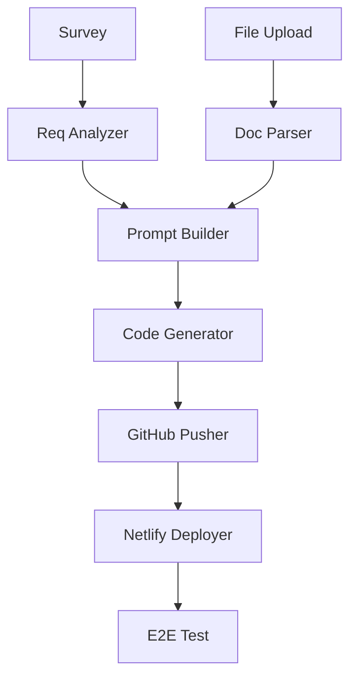
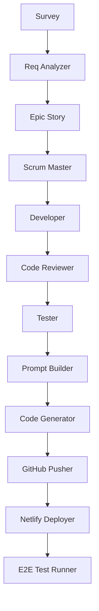

# PRD vs 실제 구현 비교 분석 보고서

**분석일:** 2026-01-18
**PRD 버전:** 1.0 (2025-01-15 작성)
**분석자:** MAGIC WAND Document Project Workflow

---

## 실행 요약

**핵심 발견:** PRD와 실제 구현 사이에 **중대한 차이**가 있으며, 이로 인해 Agent 시스템이 예상대로 동작하지 않을 가능성이 매우 높습니다.

**주요 문제:**
1. **Agent 수 차이:** PRD 8개 vs 실제 13개 (+5개 추가)
2. **워크플로우 차이:** 단순 파이프라인 vs 복잡한 계층 구조
3. **아키텍처 차이:** Claude Code 직접 실행 vs 다중 Agent 분산 처리
4. **데이터 모델 차이:** 단순 실행 기록 vs 복잡한 Epic/Story 구조

---

## 1. Agent 시스템 비교

### 1.1 PRD에 명시된 Agent (8개)

```
PRD 기반 Agent Flow:
1. Requirement Analyzer → PRD 생성
2. Document Parser → 파일 파싱
3. Prompt Builder → Claude Code 프롬프트 생성
4. Code Generator → Claude Code CLI 실행
5. GitHub Pusher → GitHub 푸시
6. Netlify Deployer → 배포
7. E2E Test Runner → 테스트
8. Issue Resolver → 이슈 해결
```

### 1.2 실제 구현된 Agent (13개)

```
실제 Agent Flow:
1. RequirementAnalyzerAgent → PRD 생성 (3개 옵션)
2. EpicStoryAgent → Epic & Story 생성 ⭐新增
3. ScrumMasterAgent → Task 관리 ⭐新增
4. DeveloperAgent → 코드 개발 ⭐新增
5. CodeReviewerAgent → 코드 리뷰 ⭐新增
6. TesterAgent → 테스트 ⭐新增
7. PromptBuilderAgent → 프롬프트 빌딩
8. CodeGeneratorAgent → 코드 생성
9. GitHubPusherAgent → GitHub 푸시
10. NetlifyDeployerAgent → 배포
11. E2ETestRunnerAgent → E2E 테스트
12. IssueResolverAgent → 이슈 해결
13. DocumentParserAgent → 문서 파싱
```

### 1.3 차이점 분석

| 항목 | PRD | 실제 구현 | 영향 |
|------|-----|-----------|------|
| **Agent 총수** | 8개 | 13개 | 🔴 **심각** - 워크플로우 복잡도 급증 |
| **Epic/Story Agent** | 없음 | 있음 | 🔴 **심각** - PRD에 없는 계층 구조 |
| **Developer Agent** | 없음 | 있음 | 🔴 **심각** - 직접 코드 개발 |
| **Code Reviewer Agent** | 없음 | 있음 | 🟡 **중간** - 품질 확인 단계 추가 |
| **Scrum Master Agent** | 없음 | 있음 | 🔴 **심각** - Task 관리 계층 추가 |
| **실행 방식** | Claude Code 직접 | 다중 Agent 분산 | 🔴 **심각** - 근본적 아키텍처 차이 |

---

## 2. 워크플로우 차이

### 2.1 PRD 워크플로우 (단순 파이프라인)

```yaml
PRD Approach:
  Trigger: 설문 제출 또는 파일 업로드
    ↓
  [Parallel] Requirement Analyzer + Document Parser
    ↓
  Prompt Builder (Claude Code 프롬프트 생성)
    ↓
  Code Generator (Claude Code CLI 실행)
    ↓
  GitHub Pusher
    ↓
  Netlify Deployer
    ↓
  E2E Test Runner
    ↓
  Complete
```

**특징:**
- **단순:** 8개 Agent가 선형으로 실행
- **Claude Code 중심:** 핵심 코드 생성은 Claude Code CLI에 의존
- **빠른 실행:** 한 번의 Claude Code 실행으로 완료

### 2.2 실제 워크플로우 (다중 계층 구조)

```yaml
Actual Implementation:
  Trigger: 설문 제출
    ↓
  RequirementAnalyzerAgent (PRD 3개 옵션 생성)
    ↓
  EpicStoryAgent (Epic & Story 생성) ⭐
    ↓
  ScrumMasterAgent (Task 목록 생성) ⭐
    ↓
  DeveloperAgent (각 Task별 코드 개발) ⭐
    ↓
  CodeReviewerAgent (코드 리뷰) ⭐
    ↓
  TesterAgent (테스트) ⭐
    ↓
  PromptBuilderAgent
    ↓
  CodeGeneratorAgent
    ↓
  GitHubPusherAgent
    ↓
  NetlifyDeployerAgent
    ↓
  E2ETestRunnerAgent
    ↓
  IssueResolverAgent
    ↓
  Complete
```

**특징:**
- **복잡:** 13개 Agent가 다단계로 실행
- **분산 처리:** 각 Agent가 특정 책임分担
- **반복:** Developer → CodeReviewer → Tester가 각 Task마다 반복

---

## 3. 아키텍처 차이

### 3.1 PRD 아키텍처

```typescript
// PRD Approach: Claude Code 중심
Claude Code CLI 실행
  ├─ 입력: Prompt Builder가 생성한 프롬프트
  ├─ 처리: Claude가 전체 코드 생성
  └─ 출력: 완성된 MVP 코드

장점:
- ✅ 간단함
- ✅ Claude Code의 능력 최대 활용
- ✅ 한 번의 실행으로 완료

단점:
- ❌ 제어력 제한
- ❌ 중간에 개입 어려움
- ❌ 실패 시 재시도 비용 큼
```

### 3.2 실제 아키텍처

```typescript
// Actual Implementation: 다중 Agent 분산
Orchestrator가 Agent 순차적 실행
  ├─ RequirementAnalyzer: PRD 생성
  ├─ EpicStoryAgent: Epic/Story 생성
  ├─ ScrumMasterAgent: Task 관리
  ├─ DeveloperAgent: 코드 개발 (각 Task)
  ├─ CodeReviewerAgent: 코드 리뷰
  ├─ TesterAgent: 테스트
  └─ ... (나머지 Agent)

장점:
- ✅ 세밀한 제어 가능
- ✅ 각 단계별 개입 용이
- ✅ 실패 시 특정 Agent만 재시도

단점:
- ❌ 복잡도 급증
- ❌ Agent 간 통신 오류 가능성
- ❌ 전체 실행 시간 증가
- ❌ PRD와의 괴리로 인한 혼란
```

---

## 4. 데이터 모델 차이

### 4.1 PRD 데이터 모델

```prisma
// PRD: AgentExecution만 존재
model AgentExecution {
  id              String   @id @default(cuid())
  projectId       String

  agentId         String
  agentName       String
  status          AgentStatus @default(RUNNING)

  startedAt       DateTime @default(now())
  completedAt     DateTime?
  retryCount      Int      @default(0)

  input           Json
  output          Json?
  error           Json?

  attachments     Json?
  comments        Json?
  activityLogUrl  String?

  project         Project  @relation(...)
}
```

### 4.2 실제 데이터 모델

```prisma
// 실제: AgentExecution + Epic/Story 구조
model Project {
  epicMarkdown  String?  @db.Text  // ⭐新增
  storyFiles    Json?              // ⭐新增

  agentExecutions AgentExecution[]
}

model AgentExecution {
  // ... (PRD와 동일)
}

// ⭐新增 Epic/Story를 storyFiles JSON 필드에 저장
```

**차이점:**
- PRD에는 없는 `epicMarkdown`, `storyFiles` 필드가 존재
- Epic & Story 데이터를 별도 테이블이 아닌 JSON으로 저장
- PRD vs 실제 구현의 데이터 구조 불일치

---

## 5. 기술 스택 차이

### 5.1 공통 부분

| 항목 | PRD | 실제 | 일치 |
|------|-----|------|------|
| Frontend | Next.js 14+ | Next.js 14.1.0 | ✅ |
| UI Library | shadcn/ui | Radix UI (shadcn) | ✅ |
| Backend | Express | Express 4.18.2 | ✅ |
| Database | Prisma + PostgreSQL | Prisma + PostgreSQL | ✅ |
| Deployment | Netlify | Netlify | ✅ |

### 5.2 차이점

| 항목 | PRD | 실제 | 영향 |
|------|-----|------|------|
| **Claude Code 사용** | 직접 CLI 실행 | Agent별 분산 실행 | 🔴 **심각** |
| **LLM 모델** | 명시 안 함 | Opus 4.5, Sonnet 4.5 | 🟡 **중간** |
| **Epic/Story 관리** | 없음 | 파일 시스템 + DB | 🔴 **심각** |
| **Task 관리** | 없음 | ScrumMasterAgent | 🔴 **심각** |

---

## 6. Agent 실행 순서 비교

### 6.1 PRD 순서 (DAG)



### 6.2 실제 순서



**차이점:**
- PRD: 8개 Agent, 단순 선형
- 실제: 13개 Agent, 5개 추가 계층

---

## 7. 핵심 문제 원인 분석

### 7.1 문제 1: PRD와 구현의 괴리

**원인:**
- Superpowers 워크플로우를 도입하면서 PRD가 업데이트되지 않음
- EpicStory, ScrumMaster, Developer Agent가 추가됨
- PRD에는 이 Agent들이 정의되어 있지 않음

**영향:**
- 🔴 **치명적:** 개발자가 PRD를 참조하면 혼란
- 🔴 **치명적:** Agent 실행 순서를 예측 불가
- 🔴 **치명적:** 문서화와 실제 코드가 불일치

### 7.2 문제 2: Claude Code 사용 방식 차이

**PRD:**
```
Prompt Builder → Claude Code CLI → 전체 코드 생성
```

**실제:**
```
EpicStory → ScrumMaster → Developer → 각 Task별 코드 생성
```

**원인:**
- PRD는 Claude Code CLI를 직접 실행하는 방식으로 설계
- 실제는 각 Task마다 LLM을 호출하여 코드 생성
- 이로 인해 DeveloperAgent에서 중복 실행 발생

**영향:**
- 🔴 **심각:** 코드 생성 전략이 완전히 다름
- 🔴 **심각:** 성능 저하 (각 Task마다 LLM 호출)
- 🔴 **심각:** PRD의 "Code Generator" Agent 역할 모호

### 7.3 문제 3: 데이터 모델 불일치

**PRD에는 없는 필드:**
- `epicMarkdown`
- `storyFiles`

**실제 구현에만 존재:**
- Epic/Story 데이터를 JSON 필드에 저장
- 별도 테이블이 아닌 비정규화된 구조

**영향:**
- 🟡 **중간:** 데이터 일관성 문제
- 🟡 **중간:** 쿼리 복잡도 증가
- 🟡 **중간:** PRD를 참조하는 ORM 사용자 혼란

---

## 8. Agent 동작 문제 원인 분석

### 8.1 근본 원인

**1. PRD와 실제 구현의 괴리**
   - PRD 작성: 2025-01-15 (1년 전)
   - Superpowers 워크플로우 도입: 그 이후
   - PRD 업데이트: 안 됨

**2. 아키텍처 변경 없는 Agent 추가**
   - EpicStoryAgent 추가
   - ScrumMasterAgent 추가
   - DeveloperAgent 추가
   - CodeReviewerAgent 추가
   - TesterAgent 추가

**3. 워크플로우 재설계 없이 구현**
   - PRD의 단순 파이프라인 유지 예상
   - 실제는 복잡한 다중 계층 구조로 구현

### 8.2 2차 원인

**1. Superpowers 워크플로우와의 통합 부재**
   - Superpowers: Epic/Story 기반 개발
   - MAGIC WAND: 단순 MVP 자동화
   - 두 워크플로우의 통합 전략 부재

**2. 문서화 부족**
   - 추가된 Agent들에 대한 문서화 부재
   - PRD 업데이트 없음
   - 개발자 간 정보 비공유

**3. 테스트 부족**
   - Agent 간 통합 테스트 부족
   - 전체 워크플로우 테스트 부족
   - 실패 시나리오 테스트 부족

---

## 9. 개선 권장사항

### 9.1 즉시 조치 (긴급)

**1. PRD 업데이트**
   - [ ] 13개 Agent로 PRD 업데이트
   - [ ] 워크플로우 다이어그램 수정
   - [ ] 데이터 모델 업데이트
   - [ ] API 명세 업데이트

**2. 문서화 보완**
   - [ ] Epic/Story 구조 문서화
   - [ ] Task 관리 워크플로우 문서화
   - [ ] Agent 간 통신 프로토콜 명확화

**3. Agent 실행 로그 개선**
   - [ ] 각 Agent의 activity log 저장
   - [ ] 진행 상황 실시간 표시
   - [ ] 실패 시 상세 에러 로그

### 9.2 중기 조치 (1-2주)

**1. 아키텍처 재검토**
   - [ ] Claude Code CLI 사용 방안 재검토
   - [ ] DeveloperAgent 역할 재정의
   - [ ] Epic/Story 생성 프로세스 최적화

**2. 워크플로우 단순화**
   - [ ] 불필요한 Agent 제거 고려
   - [ ] Agent 병합 가능성 검토
   - [ ] 병렬 실행 가능성 검토

**3. 통합 테스트**
   - [ ] 전체 워크플로우 테스트 케이스 작성
   - [ ] 실패 시나리오 테스트
   - [ ] 부하 테스트

### 9.3 장기 조치 (1개월+)

**1. Superpowers 워크플로우 완전 통합**
   - [ ] BMad Method와 Epic/Story 연동
   - [ ] Story 기반 Agent 실행
   - [ ] 개발 계획 자동화

**2. Agent 시스템 리팩토링**
   - [ ] Agent 역할 명확화
   - [ ] Agent 간 의존성 최소화
   - [ ] 에러 처리 개선

**3. 모니터링 및 디버깅**
   - [ ] Agent 실행 대시보드
   - [ ] 성능 메트릭 수집
   - [ ] 에러 추적 시스템

---

## 10. 결론

### 10.1 핵심 발견

1. **PRD는 1년 전 버전** (2025-01-15)
2. **실제 구현은 PRD와 완전히 다름** (13개 vs 8개 Agent)
3. **Superpowers 워크플로우가 추가됨** (Epic/Story/Task 구조)
4. **문서화가 전혀 따라가지 않음**

### 10.2 Agent 동작 문제의 원인

**직접적 원인:**
- PRD에 정의되지 않은 Agent들이 추가됨
- 워크플로우가 복잡하게 다단계화됨
- Agent 간 통신 오류 가능성 증가

**근본적 원인:**
- PRD 업데이트 없이 구현이 진행됨
- Superpowers 워크플로우와의 통합 전략 부재
- 문서화와 코드의 괴리

### 10.3 권장사항

**우선순위 1 (즉시):**
- PRD를 실제 구현에 맞춰 업데이트
- 추가된 5개 Agent를 PRD에 반영

**우선순위 2 (1주 이내):**
- Epic/Story 구조를 명확히 문서화
- Agent 실행 워크플로우 재검토 및 단순화

**우선순위 3 (2-4주):**
- 전체 워크플로우 테스트 및 디버깅
- Agent 간 통신 프로토콜 개선

---

## 11. 다음 단계

1. **PRD 업데이트:** 이 보고서를 바탕으로 PRD 수정
2. **문서화 보완:** docs/ 폴더에 실제 구현 반영
3. **개발자 미팅:** 워크플로우 재검토 회의
4. **테스트 계획:** 전체 시스템 통합 테스트

---

*이 보고서는 MAGIC WAND 프로젝트의 Exhaustive 스캔을 통해 생성되었습니다.*
*Generated by MAGIC WAND Document Project Workflow*
*Date: 2026-01-18*
